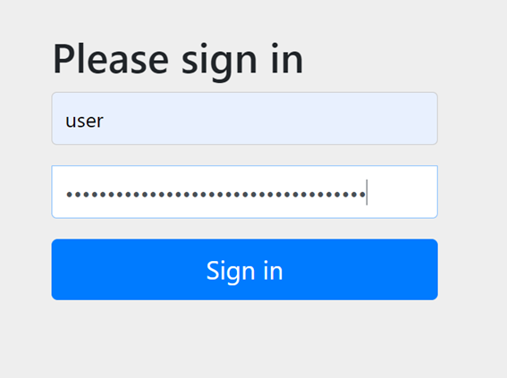
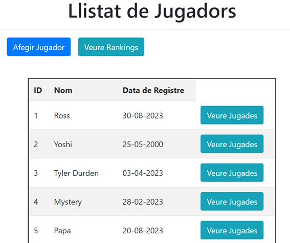
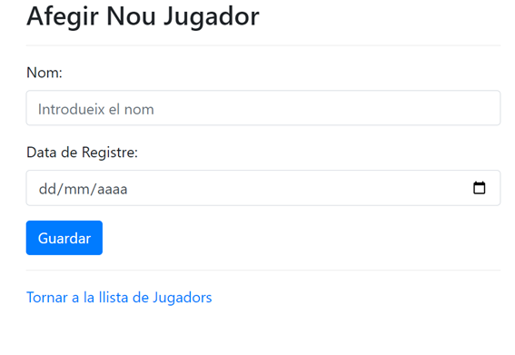
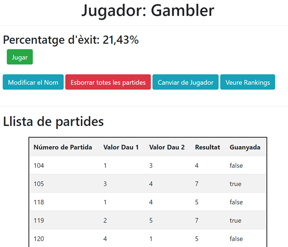

<h1 align="center">Hi 👋, I'm Sergi Carapuig Masnou</h1>
<h3 align="center">A passionate web developer from Barcelona, Spain</h3>

- 👨‍💻 All of my projects are available at [https://github.com/javert185](https://github.com/javert185)

- 📫 How to reach me **sergicarapuig@gmail.com**
  
- 💡 I am looking to improve my programming skills, with the aim of participating in innovative projects

<h3 align="center">Connect with me:</h3>

## ⚡ Technologies
### :speech_balloon: Languages

|  |  |
| ------------------------------------------------------------------------------------------------------------------------- | ----------------------------------------------------------------------------------------------------------------------------- |

### :floppy_disk: Databases

|  |  |
| ----------------------------------------------------------------------------------------------------------------------------------------- | ------------------------------------------------------------------------------------------------------------------------- |

### 🖼️ Frameworks & libraries

|  |
| ------------------------------------------------------------------------------------------------------------- |

### :wrench: Tools

|  |  |
| ------------------------------------------------------------------------------------------------------------------ | ---------------------------------------------------------------------------------------------------------- |

## 🚀 Projects

# Joc de Daus

Project link: [https://github.com/javert185/Joc_de_Daus](https://github.com/javert185/Joc_de_Daus)
